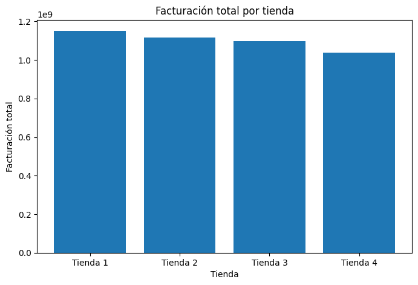
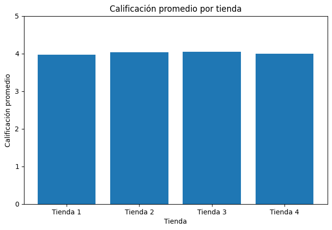

# Challenge 1 — Alura Store (Latam)

Este proyecto analiza datos de ventas, reseñas y logística de **4 tiendas** de la cadena *Alura Store* para recomendar cuál tienda debería vender el Sr. João para iniciar un nuevo emprendimiento.

---

## Objetivo
Identificar la **tienda menos eficiente** usando métricas de:
- **Facturación total**
- **Categorías más vendidas**
- **Reseñas (calificación promedio y reseñas malas)**
- **Productos más vendidos**
- **Costo de envío promedio**

---

## Estructura del repositorio
- `notebooks/` → notebook principal del análisis
- `outputs/figures/` → gráficos exportados (opcional)
- `data/raw/` → (no se suben CSV) los datos se cargan por enlace en el notebook

---

## Cómo ejecutar
1. Abrir el notebook en Google Colab:
   - `notebooks/alura_store_challenge.ipynb`
2. Ejecutar las celdas en orden.

> Nota: los archivos CSV se cargan por enlace (según el enunciado del challenge).

---

## Resultados y recomendación
Tras analizar las métricas principales (facturación, satisfacción del cliente y costos logísticos), se recomienda vender la:

✅ **Tienda X** *(reemplaza X por tu resultado final)*

**Justificación (resumen):**
- Presenta la menor facturación total frente a las demás tiendas
- No destaca en calificaciones promedio
- Mantiene costos de envío promedio menos competitivos

---

## Tecnologías
- Python
- Pandas
- Matplotlib
- Google Colab
## Visualizaciones

